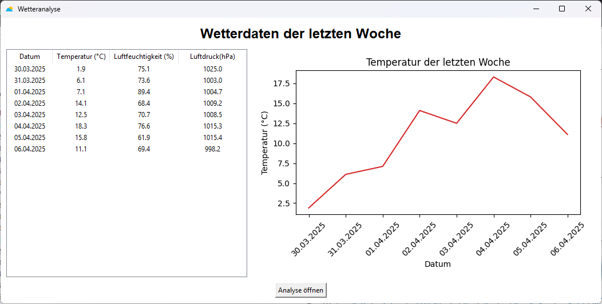
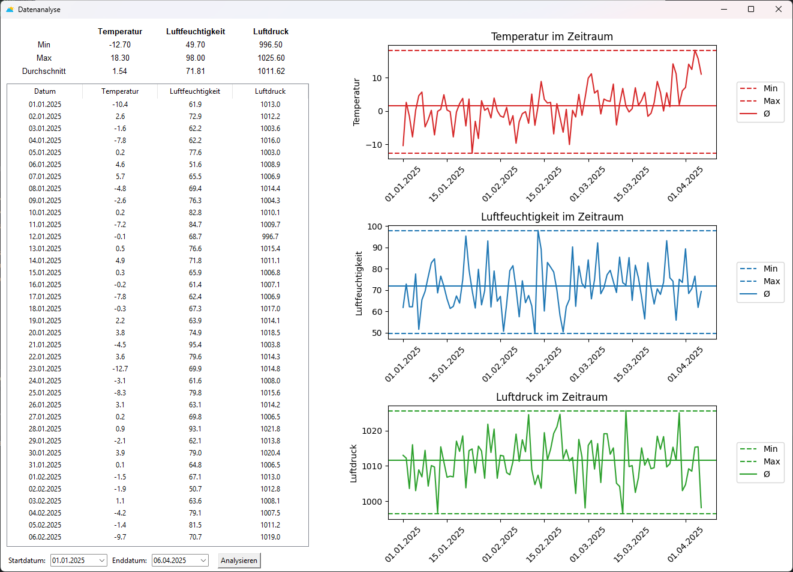

# WetterAnalyse
Eine interaktive Wetteranalyse-Anwendung mit grafischer Benutzeroberfläche, entwickelt in Python mit `tkinter` &amp; `pandas`.
Sie ermöglicht eine visuelle Auswertung historischer Wetterdaten und bietet Statistiken über definierbare Zeiträume.

## Features

- Analyse von Temperatur, Luftfeuchtigkeit und Luftdruck
- Auswahl eines Zeitraums per Kalender (tkcalendar)
- Berechnung von Minimum, Maximum und Durchschnitt
- Intuitive GUI mit Tabellenansicht (Treeview)
- CSV-Datenquelle (`wetterdaten.csv`)
- Asynchrone Datenverarbeitung (`asyncio`)
- Struktur nach MVC-Prinzip

## Screenshots



## Starten

### 1. Vorbereitungen
Python 3.10+ empfohlen. Abhängigkeiten installieren:

```bash
pip install pandas tkcalendar
```
### 2. Starten
```bash
python Main.py
```
## Fortschritt seit Kompetenzcheck
- Diagramm-Visualisierung mit matplot und seaborn im Hauptfenster und Analysefenster hinzugefügt

## TODO / Ideen
- Unittests für Model & Controller
- Exportfunktion der Analyse (PDF, Excel)
- Anbindung an eine Wetter-API (OpenWeather, DWD)

## Autor
Diese Anwendung wurde während einer Abschlussprüfung in 6 Stunden erstellt.
Es wird aktiv an der Anwendung weiterentwickelt.
